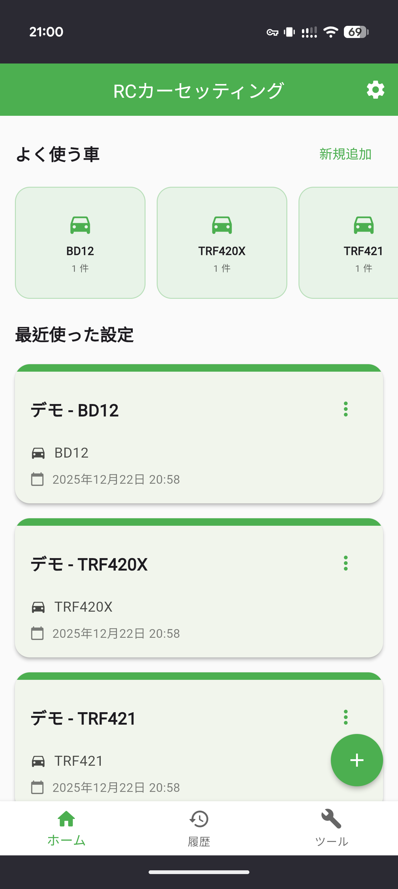
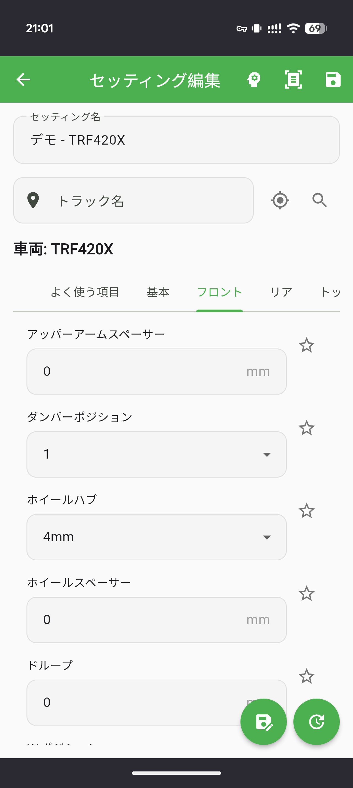

# RC Setting Manager - ラジコンセッティング記録アプリ

ラジコンのセッティングをスマホアプリで記録・管理するアプリです。
セッティングを記録するだけではなく、AIによる分析や画像からの自動読み取りも可能です。

  
  

## できること

- ラジコンカーのセッティング情報を記録・管理
- 画像からセッティング値を自動読み取り（OCR機能）
- AIによるセッティングの分析とアドバイス
- 天気情報の自動取得と記録
- トラック情報の管理と路面タイプの記録
- 複数の車種に対応
- セッティング履歴の管理
- データのインポート・エクスポート
- クラウド同期でデバイス間でデータ共有

## 提供方式

| プラットフォーム|配布方法| 備考|
|---------------|---------------|---------------|
|Android|APK or PWA             |将来的にGoogle Playに公開予定 |
|iOS|PWA（https://akiii2024.github.io/RC_Setting_Manager/） |ipa配布予定、将来的にApp Storeに公開予定|
|Web|PWA（https://akiii2024.github.io/RC_Setting_Manager/） |オフライン動作対応|

## インストール方法

### Web版（PWA）

1. ブラウザで https://akiii2024.github.io/RC_Setting_Manager/ にアクセス
2. アドレスバーの「インストール」ボタンをクリック
3. または、メニューから「ホーム画面に追加」を選択

### APK版

1. [release](https://github.com/akiii2024/RC_Setting_Manager/releases)からapkをダウンロード
2. インストール

## アプリの使い方

1. 車種を選択

ホーム画面から使用するラジコンカーの車種を選択します。

2. セッティングを記録

各セッティング項目（キャンバー、トー、ロールセンターなど）の値を入力して保存します。

3. OCR機能で自動読み取り

セッティングシートの画像を撮影またはアップロードすると、AIが自動で値を読み取って入力します。

4. AIアドバイスを活用

現在のセッティングや天気・トラック情報を基に、AIが最適なセッティングを提案します。

5. 履歴を確認

過去のセッティング履歴を確認し、比較・分析することができます。

## 主な機能

- セッティング管理（複数の車種に対応）
- OCR機能（画像からセッティング値を自動読み取り）
- AIアドバイザー（セッティングの分析と提案）
- 天気情報の自動取得（気温・湿度を自動記録）
- トラック情報管理（路面タイプの記録）
- データのインポート・エクスポート（バックアップと復元）
- クラウド同期（Firebase認証とデータ同期）
- セッティング履歴（過去の記録を確認・比較）
- 計算ツール（ギヤレシオ計算など）
- ダークモード対応
- 日本語・英語対応

## システム要件

### 対応デバイス・OS

#### Android
- **OSバージョン**: Android 5.0（API 21）以上
- **インストール方法**: APKファイルまたはPWA（プログレッシブウェブアプリ）

#### iOS
- **インストール方法**: PWA（プログレッシブウェブアプリ）
- **アクセスURL**: https://akiii2024.github.io/RC_setting_manager/
- **備考**: 将来的にApp Storeでの配布を予定

#### Web（PC・タブレット）
- **対応ブラウザ**: Chrome、Safari、Firefox、Edge等の主要ブラウザ
- **アクセスURL**: https://akiii2024.github.io/RC_setting_manager/
- **PWA対応**: ブラウザからホーム画面にインストール可能

### 必要な機能・権限

- **カメラ**: OCR機能でセッティングシートの画像を撮影する場合に必要
- **ストレージ**: セッティングデータの保存に必要
- **インターネット接続**: 
  - 基本的な機能（セッティング記録・編集）はオフラインでも利用可能
  - クラウド同期・AI機能・OCR機能・Firebase認証にはインターネット接続が必要

### 推奨環境

- **ストレージ容量**: セッティングデータの保存に応じた空き容量が必要（目安：数十MB以上）
- **メモリ**: スムーズな動作のため、十分な空きメモリを推奨
- **画面サイズ**: スマートフォン・タブレット・PCの各種画面サイズに対応

### 動作確認環境

以下の環境でテストを行っています。
- Samsung Galaxy S24 - Android 16 One UI 8.0
- Google Pixel 10 Pro - Android 16
- iPhone 15 Pro Max - iOS 17.5.1
